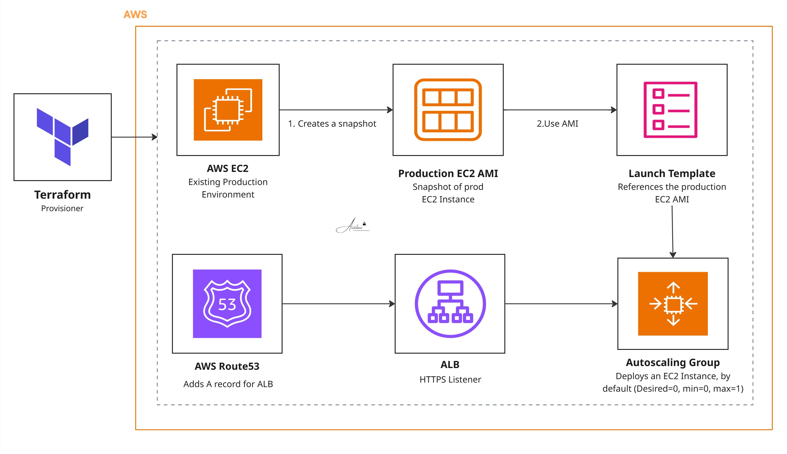

# Project 29: Pilot-Light Disaster Recovery (Terraform)

I built this Terraform module to set up a classic "pilot-light" disaster recovery scaffold on AWS. When you run `terraform apply`, it takes a snapshot of a live production EC2 instance, makes a datestamped AMI, and then spins up a full replacement stack. 

The real trick here is that the Auto Scaling Group (ASG) sits at `desired_capacity = 0` during steady state. That keeps your monthly AWS bill focused mostly on the static ALB costs, rather than burning money on idle EC2 compute hours.

## Architecture



### How to Failover

When an incident hits, the recovery process is dead simple:
1. Manually bump the ASG to `desired = 1`. The new instance boots up using the most recent point-in-time AMI.
2. Traffic starts flowing through the DR ALB via the pre-configured Route 53 alias (`prod-dr.<domain>`). Alternatively, you can just flip your main production DNS record to point at this DR ALB.

## What It Provisions

- **`aws_ami_from_instance`** — Generates a fresh, datestamped AMI from the live source instance.
- **Launch Template** — Points to the newly minted AMI. 
- **Auto Scaling Group** — Spans the provided subnets. Hardcoded to `desired = 0, min = 0, max = 1`.
- **Application Load Balancer** — Internet-facing, listening on port 443 using your provided ACM certificate.
- **Target Group** — Routes traffic to port 80 / HTTP (TLS terminates at the ALB).
- **Route 53 Alias** — Creates the `prod-dr.<domain>` record routing into the ALB.

## Stack

Terraform 1.x · AWS Provider · EC2 AMIs · Launch Templates · Auto Scaling Groups · Application Load Balancer · ACM · Route 53

## Required Inputs

| Variable | Purpose |
|---|---|
| `source_instance_id` | The live production EC2 instance you want to snapshot |
| `vpc_id` | Existing VPC where the DR stack will live |
| `subnet_ids` | Subnets for the ASG and ALB |
| `security_group_id` | Pre-existing security group to apply |
| `instance_type` | Compute size for the Launch Template |
| `certificate_arn` | ACM certificate for the HTTPS listener |
| `hosted_zone_id` | Route 53 hosted zone ID for the DNS record |
| `domain_name` | Domain used to construct the `prod-dr.<domain>` alias |
| `project_name`, `environment` | Naming convention variables for tagging and AMI naming |

## Deployment & Teardown

```bash
# Standard deployment
terraform init
terraform plan
terraform apply

# To destroy the stack
terraform destroy
```

## The "Gotchas" (Technical Debt & Known Issues)

This module works great as a scaffold, but I left a few deliberate design trade-offs in here that you'd want to clean up before pointing it at a true enterprise production workload:

* **The AMI timestamp bug:** The AMI naming uses `formatdate("YYYY-MM-DD", timestamp())`. Because `timestamp()` is evaluated on every single plan, Terraform will force a brand new AMI and Launch Template version on *every* apply, even if you didn't change anything. **The fix:** Add a `lifecycle { ignore_changes = [name] }` block, or better yet, move the snapshot logic out of Terraform and into a scheduled EventBridge/Lambda cron job.
* **Shared Security Groups:** Right now, the ALB and the EC2 instances share the exact same security group. A hardened production setup should split those—one SG letting HTTPS into the ALB, and an internal SG letting only ALB traffic hit the instance.
* **Public IP addresses:** The Launch Template sets `associate_public_ip_address = true`, meaning your DR instances get public IPs. It's functional, but best practice dictates tossing them into private subnets and keeping only the ALB public.
* **Plaintext internal traffic:** TLS terminates at the ALB, so traffic jumping from the load balancer to the EC2 instances is unencrypted. If your compliance team demands end-to-end encryption, you'll need to switch the target group to HTTPS and manage certificates on the instance itself.
* **No HTTP-to-HTTPS redirect:** The ALB only listens on 443. Port 80 requests will just drop instead of gracefully redirecting, which can be annoying for browser clients.
* **Dated TLS Policy:** It defaults to `ELBSecurityPolicy-2016-08`. Unless you absolutely have to support ancient browsers, bump that up to `ELBSecurityPolicy-TLS13-1-2-2021-06`.
* **Reboot during snapshot:** By default, taking an AMI reboots the source instance to ensure filesystem consistency. If you point this at a live production box, it *will* cause a blip. Set `snapshot_without_reboot = true` if your application can tolerate a crash-consistent snapshot, or only run this during a maintenance window.
* **Local state is gone forever:** AMIs are point-in-time. Any local disk writes that happen after the snapshot are lost if you fail over. Always keep your persistent state tucked away in RDS, EFS, or S3.
